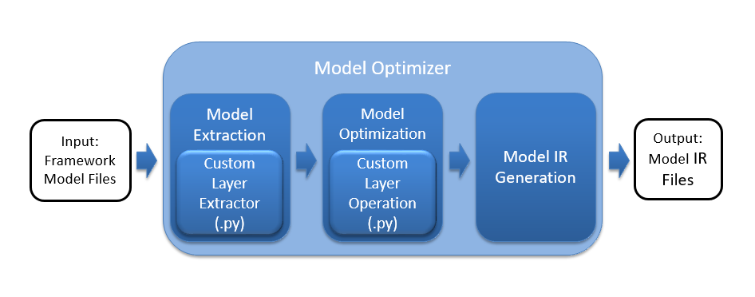

# Project Write-Up

**_Theme_** : People counter App optimized using the [Intel OpenVino Toolkit](https://software.intel.com/content/www/us/en/develop/tools/openvino-toolkit.html) for running at the edge.

**_Author_**: DZE RICHARD


## Explaining Custom Layers

### AI and the emergence of custom layers
It is arguably impossibility talking of the reasons behind th rise of astonishing AI applications emerging across the world without mentioning to the awesome researches in the field of Deep learning.

Deep learning is based on Artificial Neural Networks which are computing systems consisting of a combination of layers. Hence building deep learning models that would accomplish a given task could involve including one or more custom layer to carryout specific operation(s).

### Handling custom layers
When converting a model into an Intermediate representation(IR) or loading the IR through the infernce engine, if the topology contains an unsupported layer, that layer is to be treated like a custom layer.  
When implementing a custom layer for your pre-trained model in the Intel® Distribution of OpenVINO™ toolkit, you will need to add extensions to both the Model Optimizer and the Inference Engine.
#### For the model optimizer:
The custom layer extensions needed by the Model Optimizer are:

* Custom Layer Extractor
     > Responsible for identifying the custom layer operation and extracting the parameters for each instance of the custom layer. The layer parameters
     > are stored per instance and used by the layer operation before finally appearing in the output IR. Typically the input layer parameters are unchanged,⋅
     > which is the case covered by this tutorial.

* Custom Layer Operation
     > Responsible for specifying the attributes that are supported by the custom layer and computing the output shape for each instance of the custom layer from its parameters. 
     > The --mo-op command-line argument shown in the examples below generates a custom layer operation for the Model Optimizer.



#### For the Inference engine:
The following figure shows the basic flow for the Inference Engine highlighting two custom layer extensions for the CPU and GPU Plugins, the Custom Layer CPU extension and the Custom Layer GPU Extension.
Each device plugin includes a library of optimized implementations to execute known layer operations which must be extended to execute a custom layer. The custom layer extension is implemented according to the target device:

* Custom Layer CPU Extension
     >A compiled shared library (.so or .dll binary) needed by the CPU Plugin for executing the custom layer on the CPU.
* Custom Layer GPU Extension
     >OpenCL source code (.cl) for the custom layer kernel that will be compiled to execute on the GPU along with a layer description file (.xml) needed by the GPU Plugin for the custom layer kernel.


## Comparing Model Performance

I made greater emphasis on the inference time and model size before and after conversion into Intermediate representation(IR).

### Model Size: ###

|                       | **SSD MobileNet V1 Coco** | **SSD MobileNet V2 Coco** | **SSD Inception V2** |
| :-------------------: |   :-------------------:   |   :-------------------:   |   :--------------:   |
| Pre-conversion        |          28 MB            |         67 MB       	     |          98 MB       |
|  post conversion      |          26 MB            |         65 MB             |          96 MB       |

### Inference time ###
After converting the models into IR and performing inference on the video stream, average inference time for each were as follows:

| **SSD MobileNet V1 Coco** | **SSD MobileNet V2 Coco** | **SSD Inception V2** |
|   :-------------------:   |   :-------------------:   |   :--------------:   |
|          50ms             |         70 ms       	 |        158 ms        |

## Assess Model Use Cases

1. **Queue Management**:

  * It could be used to determine the number of people who could queue up in front of a sales points and evaluate if there may be a need to add the sales points for faster service to customers.

2. **Security system** :

  * It could be used to detect people in an unauthorized zone and alert.

3. **Customer behavior**:

  * It could be used to calculate the conversion rate by calculating how long customer is looking at a product and if he/she end up buying it.

## Assess Effects on End User Needs

Lighting, model accuracy, and camera focal length/image size have different effects on a
deployed edge model. The potential effects of each of these are as follows:

* Lighting
   Poor lighting conditions could go a long way in reducing the model accuracy. It could be a good practice the case of surveillance cameras to close light sources for operation in dark conditions. Also augmenting the dataset with images taken under dark conditions could and help the model perform better in dark conditions.  


* Image size/Focal length
    Under certain focal lengths, properties of the object could be missed and the model would not be able to properly detect the object. Image size hinders the model accuracy as if it differs from the original size which the model hence affecting the confusion matrix.

## Model Research

In investigating potential people counter models, I tried each of the following three models:

- Model 1: **SSD MobileNet V1 Coco**
  - Model source: [Here](http://download.tensorflow.org/models/object_detection/ssd_mobilenet_v1_coco_2018_01_28.tar.gz)


- Model 2: **SSD MobileNet V2 Coco**
  - Model source: [Here](http://download.tensorflow.org/models/object_detection/ssd_mobilenet_v2_coco_2018_03_29.tar.gz)


- Model 3: **SSD Inception V2**
  - Model Source: [Here](http://download.tensorflow.org/models/object_detection/ssd_mobilenet_v2_coco_2018_03_29.tar.gz)

To convert the model into IR , I proceeded as follows:
1. Downloaded the model
    e.g ```wget http://download.tensorflow.org/models/object_detection/ssd_mobilenet_v2_coco_2018_03_29.tar.gz```

2. untar the model tar.gz file
    e.g ```tar -xzvf ssd_mobilenet_v2_coco_2018_03_29.tar.gz```

3. cd to the untarred directory
    e.g ```cd ssd_mobilenet_v2_coco_2018_03_29```

4. Once in diretory converted the frozen models into IR using the model Optimizer
    e.g ```python /opt/intel/openvino/deployment_tools/model_optimizer/mo.py --input_model frozen_inference_graph.pb --tensorflow_object_detection_api_pipeline_config pipeline.config --reverse_input_channels --tensorflow_use_custom_operations_config /opt/intel/openvino/deployment_tools/model_optimizer/extensions/front/tf/faster_rcnn_support.json```

## Additional notes

From experimenting with these models, it's rather without doubt that making use of the openvino toolkit helps a lot in optimizing the models for deployment on edge devices.
However this hinders the model's accuracy ,though I believe it could be tolerated in a lot of scenarios due some importance such as;
- Saving the user from sending sensitive data to the cloud as inference could be performed offline on the edge device.
- Helping to avoid spending much on network communication.
#### Some tradeoffs encountered were:
- The models usually takes much time to detect and did not keep the bounding box: To try tackling that, I set a confidence threshold as low as 0.5
- Since the models did not keep a bounding box for long, the same person in the same could be counted severally, hence tricking the stats:  To try tackling this, I set time thresholds before a detection could be added to total counts.
